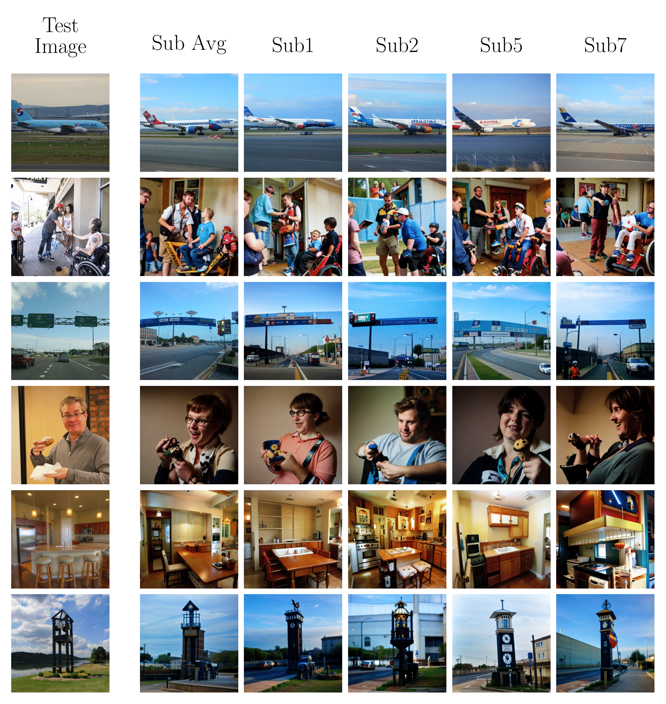

# Original Brain-Diffuser Repo
Official repository for the paper ["**Brain-Diffuser: Natural scene reconstruction from fMRI signals using generative latent diffusion**"](https://arxiv.org/abs/2303.05334) by Furkan Ozcelik and Rufin VanRullen.

## Results
The following are a few reconstructions obtained : 

## Instructions (FOR NEUROTECH MEMBERS) ##
In this repo is essentially a wrapper for the original paper's architecture and results. Members can use the notebook to run the diffusion model and create a image reconstructed from CLIP image, text weights produced by fMRI data and a initial guess image produced by fMRI data. To run the notebook:

1. Make sure you are logged into the NTAB Software account

2. Open the notebook on colab and select the T4 GPU as your runtime

3. Run all the cells in the order they are descibed, you will have to re-run the first cell 3 times